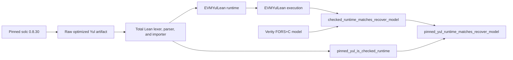

# FORS+C Verifier: Plain-English Briefing for Antonio

Date: 2026-06-15

## TLDR

The on-chain FORS+C recovery logic has been proved correct for the pinned
verifier artifact.

That means we checked, with Lean, that the verifier:

- reads the signature and digest from calldata correctly;
- rejects the wrong signature length;
- enforces the FORS+C grinding condition;
- reconstructs all 25 transmitted FORS trees with the correct sibling order;
- compresses the roots correctly;
- derives and returns the correct Ethereum address.

This is not only a proof of a clean mathematical model. The proof symbolically
executes the complete selector dispatcher and recovery function imported from
the pinned compiler output into EVMYulLean, including every loop iteration and
both rejection paths.

## The theorem reviewers should read first

The intentionally small theorem surface is in
`verity/NiceTry/Fors/Bridge/ReviewSurface.lean`.

The main review theorem is:

```lean
theorem pinned_yul_runtime_matches_recover_model :
  parseDeployedRuntime pinnedForsOptimizedYul = .ok forsVerifierRuntime ∧
    ∀ raw digest, ForsAbiInput raw digest →
      evmRunWithRuntime forsVerifierRuntime raw digest =
        recoverOrZero raw digest
```

In plain language:

1. the pinned optimized-Yul artifact parses to the exact EVMYulLean runtime we
   execute in Lean;
2. for every ABI-representable signature and digest, that runtime returns the
   same address as the clean FORS+C recovery model;
3. when the model rejects, `recoverOrZero` matches the contract convention of
   returning `address(0)`.

The detailed review path is documented in
`verity/NiceTry/Fors/Bridge/REVIEW_PATH.md`. It walks from the FORS+C Lean
model, through the EVMYulLean execution proof, to the pinned compiler artifact
and production deployment checks.

## Can we say it is safe to deploy?

Yes, with explicit conditions.

The exact statement we can defend is:

> If the deployed `ForsVerifier` bytecode exactly matches the pinned artifact,
> the wallet accepts only when `recover(signature, digest)` equals its current
> nonzero owner, and the signer follows the required key-rotation policy, then
> we can rely on the verifier to enforce the modeled FORS+C recovery algorithm
> correctly, assuming Ethereum Keccak behaves correctly.

We should not say:

> The whole wallet is unconditionally formally verified and cannot be hacked.

That would be broader than the proof.

## One critical usage detail

`recover` is not a boolean `isValidSignature` function.

A malformed 2,448-byte signature can return a nonzero address that is simply
the wrong address. Therefore this is unsafe:

```solidity
require(verifier.recover(signature, digest) != address(0));
```

The safe pattern is:

```solidity
address recovered = verifier.recover(signature, digest);
require(recovered != address(0) && recovered == currentOwner);
```

`SimpleAccount` uses the safe pattern.

## What the proof rules out

For the pinned verifier artifact, the proof rules out implementation mistakes
such as:

- reading `R`, `pkSeed`, the counter, or tree openings from the wrong offsets;
- accepting a signature with the wrong length;
- skipping or reversing the grinding guard;
- using the wrong five-bit message index for a tree;
- swapping left and right Merkle children incorrectly;
- using the wrong ADRS tree, level, or node index;
- executing the loop the wrong number of times;
- writing a root into the wrong memory slot;
- hashing the wrong root buffer;
- returning the wrong 160 bits as the signer address;
- routing the ABI selector or dynamic `bytes` argument incorrectly.

These are exactly the classes of low-level assembly bugs that are difficult to
exclude with ordinary tests.

## How this compares with the SPHINCS- work Antonio shared

Antonio also shared the
[SPHINCS- Verity repository](https://github.com/nconsigny/SPHINCS-/tree/main/verity)
and its
[Ethereum Research article](https://ethresear.ch/t/sphincs-minus-efficient-stateless-post-quantum-signature-verification-on-the-evm/25165).

The two projects prove different things:

| Project              | Cryptographic scope                                                                                                 | Implementation correspondence                                                                                                                                                                                                               |
| -------------------- | ------------------------------------------------------------------------------------------------------------------- | ------------------------------------------------------------------------------------------------------------------------------------------------------------------------------------------------------------------------------------------- |
| SPHINCS- Verity work | Broader: complete C13 and SLH-DSA-style verifiers, including FORS/FORS+C, WOTS+/WOTS+C, and hypertree verification. | Its Verity models are hand-transcribed from production assembly. Its README says the models are not deployed, compiled into the contracts, or replayed against the on-chain verifier; correspondence rests on reviewing that transcription. |
| This project         | Narrower: the standalone FORS+C recovery component used by our wallet.                                              | Stronger at the targeted runtime boundary: a total Lean parser imports the pinned optimized Yul, and EVMYulLean executes the resulting dispatcher, rejection paths, all 25 trees, roots compression, and address return.                    |

Their C13 theorem is a useful independent full-scheme reference. At the time of
this briefing, their README reports three remaining residual assembly axioms
for `c13_refines_spec`, with follow-up work intended to discharge them.

This does not make either project a replacement for the other. Their work
provides substantially broader algorithmic coverage. Our work provides a
tighter execution-level proof for a smaller deployed component.

The accurate summary is:

> Their proof covers more of the cryptographic scheme. Our proof establishes a
> tighter implementation-level correspondence for the smaller FORS+C
> component.

FORS+C is the bottom few-time-signature layer inside a full SPHINCS-style
construction. A complete SPHINCS verifier additionally authenticates that FORS
result through WOTS and hypertree layers. Our wallet instead uses the recovered
FORS+C address directly and rotates ownership operationally, so those upper
SPHINCS layers are intentionally outside this verifier's scope.

## What remains outside the proof

The verifier proof does not establish all production security by itself.

| Condition                                  | Status                         | Why it matters                                                                                                  |
| ------------------------------------------ | ------------------------------ | --------------------------------------------------------------------------------------------------------------- |
| Verifier algorithm and low-level execution | Proved                         | The runtime parsed from pinned optimized Yul agrees with the Lean FORS+C recovery model.                        |
| Optimized-Yul to EVMYulLean correspondence | Proved                         | Lean's kernel checks that parsing the tracked raw Yul produces exactly the runtime used by the execution proof. |
| Solidity-to-optimized-Yul compilation      | Trusted                        | We pin `solc 0.8.30`, but do not formally verify the compiler.                                                  |
| Actual on-chain bytecode identity          | Must be checked per deployment | The deployed bytecode must match the output produced by the pinned source and compiler settings.                |
| Keccak implementation and hash security    | Trusted                        | The proof treats Keccak as the standard correct hash primitive.                                                 |
| FORS+C unforgeability estimates            | Inherited, not re-proved       | The proof establishes correct implementation, not a new cryptographic security theorem.                         |
| Signer key lifecycle                       | Operational requirement        | Reusing a few-time key weakens security; normal operation must rotate and burn keys.                            |
| Wallet and EntryPoint integration          | Separate review scope          | The theorem covers `ForsVerifier.recover`, not every wallet, bundler, signer, or recovery path.                 |

## How compiler output enters the proof

The previously manual optimized-Yul transcription is now closed by a total
Lean lexer, parser, and importer. It reads the exact tracked
`forge inspect ... irOptimized` output, selects the unique deployed object,
normalizes the `$` identifiers used by `solc`, and constructs the EVMYulLean
runtime.

Lean's kernel checks:

```lean
parseDeployedRuntime pinnedForsOptimizedYul = .ok forsVerifierRuntime
```

The public result then combines that equality with the completed execution
proof:

```lean
parseDeployedRuntime pinnedForsOptimizedYul = .ok forsVerifierRuntime ∧
  ∀ raw digest, ForsAbiInput raw digest →
    evmRunWithRuntime forsVerifierRuntime raw digest =
      recoverOrZero raw digest
```

This is not a test that happened to pass once. The equality is a theorem
checked from the tracked Yul text. Changing a meaningful token in that artifact
changes the parser result and causes the theorem or exact-artifact audit to
fail.



The manual Yul-to-EVMYulLean transcription is therefore no longer trusted.
The remaining provenance boundary is earlier and later in the toolchain:

1. We trust pinned `solc 0.8.30` to compile the Solidity source correctly.
2. We must check that the bytecode deployed at the production address exactly
   matches the bytecode generated with those pinned settings.

The parser does not claim to verify `solc`, and it does not prove that an
arbitrary Ethereum address contains the checked bytecode.

## Production go/no-go checklist

Call the verifier production-ready only when every item below is green:

1. Run `./scripts/audit-fors-verifier.sh` successfully.
2. Run `./scripts/check-deployed-fors-verifier.sh RPC_URL VERIFIER_ADDRESS`.
3. Confirm the wallet's immutable `VERIFIER` is that checked address.
4. Confirm every caller checks both `recovered != address(0)` and
   `recovered == currentOwner`.
5. Confirm the signer computes the exact digest expected by the wallet.
6. Confirm the signer burns or retires the current FORS key before releasing a
   fresh signature and rotates to `nextOwner`.
7. Treat replacement signatures as explicit bounded key reuse, never as an
   unlimited retry mechanism.

If any item is red, do not describe the deployed system as verified.

## Current result

The verifier-logic part is green.

The repository audit builds the full Lean project and reports exactly two
project assumptions:

- the proved EVM transcript bytes hash to the model's Keccak value;
- EVMYulLean's external Keccak function returns 32 bytes.

There is no `sorry` in the final theorem's dependency closure.

The Merkle loop and compiler-output import are both proved. The remaining
production decision is whether the pinned compiler and deployment-identity
checks are acceptable boundaries for the intended deployment.

## Recommendation

It is reasonable to use the pinned `ForsVerifier` as the on-chain FORS+C
recovery component after the production checklist passes.

The strongest honest summary is:

> The verifier computation, including importing its pinned optimized Yul into
> EVMYulLean, is formally checked. Pinned-compiler trust, deployment identity,
> correct recover-and-compare usage, Keccak, and safe few-time-key operation
> remain explicit production conditions.
