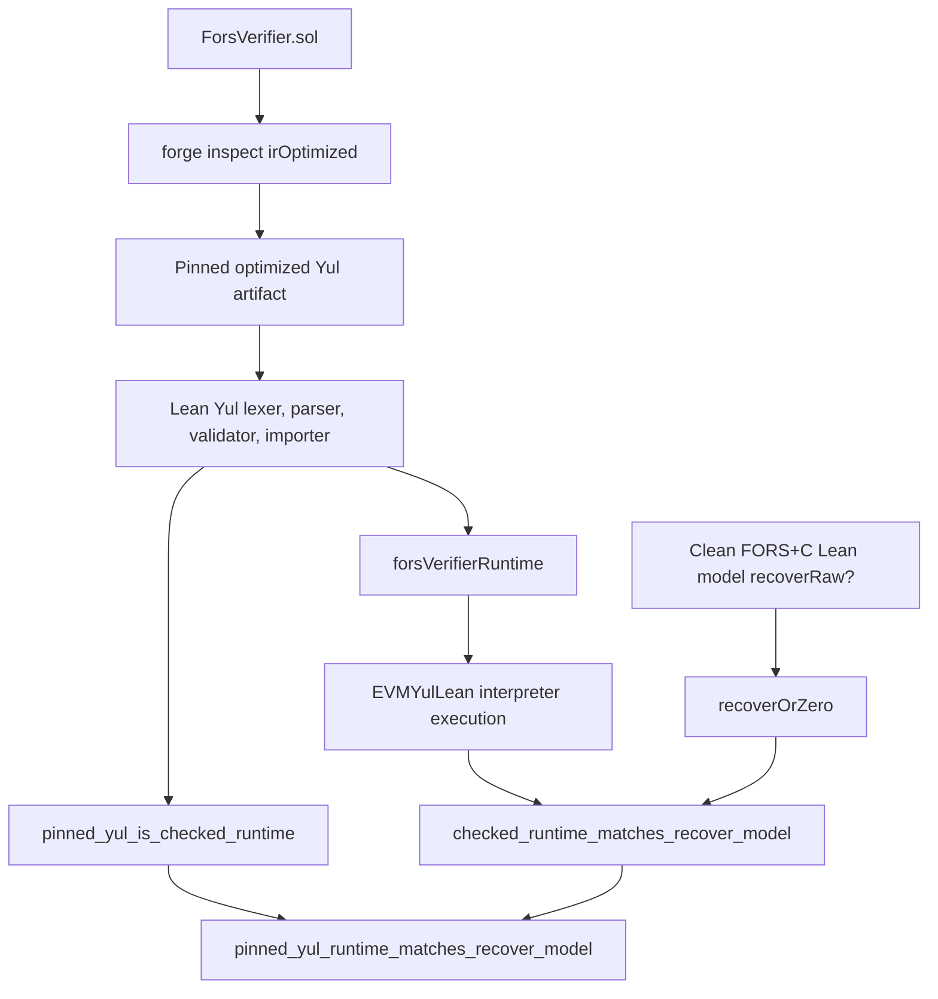

# FORS+C verifier review path

This is the shortest path for a reviewer who does not already know the codebase.
Read the small theorem surface first, then decide how deep to go into the model,
the EVMYulLean execution proof, and the compiler-artifact provenance.

## The claim to review

The public claim is:

> The pinned optimized-Yul artifact for `ForsVerifier.recover(bytes,bytes32)`
> parses to the EVMYulLean runtime used in the proof, and executing that runtime
> returns the same address as the clean FORS+C recovery model for every
> ABI-representable signature and digest.

The reviewer-facing theorem is:

```lean
NiceTry.Fors.Bridge.pinned_yul_runtime_matches_recover_model :
  parseDeployedRuntime pinnedForsOptimizedYul = .ok forsVerifierRuntime ∧
    ∀ raw digest, ForsAbiInput raw digest →
      evmRunWithRuntime forsVerifierRuntime raw digest =
        recoverOrZero raw digest
```

Read it in:

- [`ReviewSurface.lean`](./ReviewSurface.lean)
- [`Audit.lean`](./Audit.lean)

`recoverOrZero` is just the verifier's public convention: model failure
(`none`) is returned by the contract as `address(0)`.

## Full proof path



## Step 1: Review the theorem surface

Start with [`ReviewSurface.lean`](./ReviewSurface.lean). It intentionally has
boring names:

- `pinned_yul_is_checked_runtime`
- `checked_runtime_matches_recover_model`
- `pinned_yul_runtime_matches_recover_model`
- `legitimate_fors_signature_recovers_expected_address`

These are wrappers around the detailed proof. If these statements are the right
claims, the remaining files explain why Lean accepts them.

## Step 2: Review the clean FORS+C model

The model is the thing the runtime is proved against.

- [`../Types.lean`](../Types.lean): signature layout, tree indices, raw-signature
  interface.
- [`../Hash.lean`](../Hash.lean): transcript shapes for Hmsg, leaves, nodes,
  root compression, and address derivation. Keccak output is opaque here.
- [`../Model.lean`](../Model.lean): `forcedZero`, tree reconstruction,
  `recoverRoot`, `recoverRaw?`.
- [`../Spec.lean`](../Spec.lean): what counts as a legitimate FORS+C signature.
- [`../Proofs/Basic.lean`](../Proofs/Basic.lean): model sanity theorems,
  especially `legit_raw_signature_recovers_expected_address`.

This layer does not prove cryptographic unforgeability. It fixes the exact
algorithm and byte layout that the implementation must match.

## Step 3: Review the EVMYulLean execution boundary

This is where the pinned runtime is symbolically executed.

- [`EvmRun.lean`](./EvmRun.lean): ABI calldata encoding and the observable
  `evmRun`.
- [`RawDomain.lean`](./RawDomain.lean): the exact ABI-representable input domain.
- [`Phase4.lean`](./Phase4.lean): the final execution theorem assembled from the
  bad-length, failed-grinding, and accepting branches.
- [`DispatcherRoute.lean`](./DispatcherRoute.lean): selector and ABI routing to
  `recover`.
- [`TreeLoop.lean`](./TreeLoop.lean) and [`Phase4Accept.lean`](./Phase4Accept.lean):
  the full 25-tree accepting path and root-buffer proof.
- [`Phase4Reject.lean`](./Phase4Reject.lean): rejection paths.

The long files are proof plumbing. The review question is whether the small
branch theorems in `Phase4.lean` are the right decomposition of the runtime
behavior.

## Step 4: Review the compiler-artifact link

The proof no longer trusts a manual Yul transcription.

- [`ForsYulArtifact.lean`](./ForsYulArtifact.lean): includes the pinned optimized
  Yul text and proves `parse_pinned_fors_runtime`.
- [`YulParser.lean`](./YulParser.lean): total Lean lexer, parser, validator, and
  importer for the supported optimized-Yul fragment.
- [`ParsedRuntime.lean`](./ParsedRuntime.lean): combines the parser result with
  the execution theorem.
- [`../../../artifacts/fors-verifier-runtime/ForsVerifier.irOptimized.yul`](../../../artifacts/fors-verifier-runtime/ForsVerifier.irOptimized.yul):
  the tracked compiler artifact.

The remaining provenance boundary is outside Lean: pinned `solc 0.8.30` must be
trusted to produce the optimized Yul and bytecode, and each deployment must be
checked against that pinned output.

## Step 5: Understand the auxiliary Verity kernels

The repository also contains Verity-generated FORS kernels:

- [`../Verity/GuardKernel.lean`](../Verity/GuardKernel.lean)
- [`../Verity/TreeShapeKernel.lean`](../Verity/TreeShapeKernel.lean)
- [`../Verity/TreeKeccakKernel.lean`](../Verity/TreeKeccakKernel.lean)
- [`../Verity/FullVerifierKernel.lean`](../Verity/FullVerifierKernel.lean)

These are useful reference artifacts and obligation accounting, but they are not
the deployed-runtime theorem. Their status is tracked in
[`OBLIGATIONS.md`](./OBLIGATIONS.md): nine of eleven local obligations are backed
by Lean theorems, and two full-loop choreography obligations remain documented
for the auxiliary kernel artifact.

Important distinction:

- `pinned_yul_runtime_matches_recover_model` certifies the parser-certified
  deployed runtime.
- The Verity kernels document and cross-check the generated-reference path.

Do not treat the two remaining Verity-kernel obligations as dependencies of the
final deployed-runtime theorem.

## Step 6: Reproduce the audit

From `NiceTry`:

```bash
./scripts/audit-fors-verifier.sh
```

Or from `NiceTry/verity`:

```bash
lake build NiceTry
lake env lean NiceTry/Fors/Bridge/Audit.lean
```

The expected project assumptions under the review theorem are exactly:

- `evm_keccak_transcript`: EVM Keccak over the proved transcript bytes agrees
  with the model's opaque Keccak value.
- `ffi_kec_size`: EVMYulLean's external Keccak function returns 32 bytes.

Lean core assumptions such as `propext`, `Classical.choice`, and `Quot.sound`
also appear in `#print axioms`.

## Step 7: Production checks

The proof covers `ForsVerifier.recover`, not the entire production system. A
deployment is only in scope after:

1. the deployed bytecode matches the pinned compiler output;
2. the wallet compares `recovered != address(0)` and `recovered == currentOwner`;
3. the signer computes the intended digest;
4. the FORS few-time key is rotated and retired according to policy.
